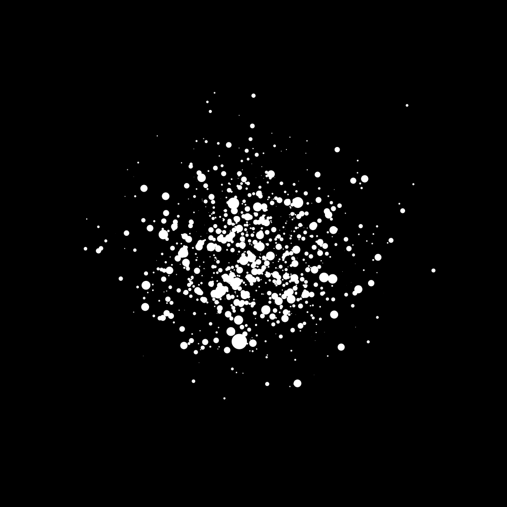

Randompoints
============

A (very) small script. Attempts to create minimal generative art,
playing with uniform, gaussian and Pareto distributions for random variables.

Controls:
---------

- 'p': prints current frame.

Example:
--------

